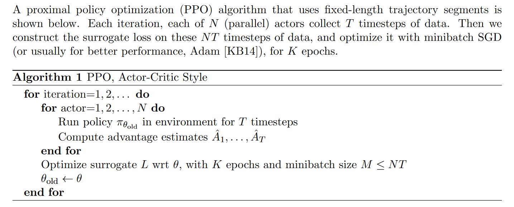

# Introduction to Proximal Policy Optimization

[Proximal Policy Optimization](https://arxiv.org/abs/1707.06347) (PPO) is proposed by OpenAI in 2017. As a algorithm of policy gradient RL, ppo has some of the benefits of trust region policy optimization (TRPO), but it is much simpler to implement, more general, and have better sample complexity. Here we discuss its core innovative technology.

## Origin of idea

TRPO has some notable shortcomings:

- Complexity: TRPO is challenging to interpret, implement, and debug. When training does not yield the expected results, identifying how to improve performance can be difficult and time-consuming.
- Compatibility: TRPO is incompatible with architectures that involve noise (such as dropout) or parameter sharing (e.g., between the policy and value function, or with auxiliary tasks).
- Efficiency: TRPO requires the computation of the Fisher information matrix, which involves second-order optimization. As a result, it cannot leverage first-order optimizers like Adam.

## Innovative technology

The obejective function in TRPO is maximized subject to a constraint on the size of the policy update:

$$
\underset{\theta}{\text{maximize}} \ E_{t}\left[\frac{\pi_{\theta}\left(a_{t} \mid s_{t}\right)}{\pi_{\theta_{\text{old}}}\left(a_{t} \mid s_{t}\right)} A_{t}\right]
$$
$$
\text{ subject to } E_{t}\left[\mathrm{KL}\left[\pi_{\theta_{\text{old}}}\left(\cdot \mid s_{t}\right), \pi_{\theta}\left(\cdot \mid s_{t}\right)\right]\right] \leq \delta
$$

Here, $\theta_{old}$ is the vector of policy parameters before the update and $A_{t}$ is an estimator of the advantage function at timestep $t$.

PPO Clip and PPO Penalty are two specific variants of the PPO algorithm.

### PPO Penalty
PPO Penalty convert the above constraints into penalty terms:

$$
\underset{\theta}{\text{maximize}} \ E_{t}\left[\frac{\pi_{\theta}\left(a_{t} \mid s_{t}\right)}{\pi_{\theta_{old}}\left(a_{t} \mid s_{t}\right)} A_{t}  - \beta KL\left[\pi_{\theta_{old}}\left(\cdot \mid s_{t}\right), \pi_{\theta}\left(\cdot \mid s_{t}\right)\right]\right]
$$

But fixed beta is not enough, dynamic adjustment is needed. Because as the optimization problem progresses, even for the same problem, the characteristics may change. This adjustment in PPO is based on heuristics:

- Compute $d= E_{t}[KL\left[\pi_{\theta_{old}}\left(\cdot \mid s_{t}\right), \pi_{\theta}\left(\cdot \mid s_{t}\right)\right]]$
  - If $d<d_{targ} / 1.5, \beta \leftarrow \beta / 2$
  - If $d>d_{targ} \times 1.5, \beta \leftarrow \beta \times 2$

Here, $d_{targ}$ is the target value of $d$ that we have set.

### PPO Clip
PPO Clip, the most popular variant of PPO, performs better than PPO Penalty.

Now, let's review the objective function in TRPO. Our goal is to prevent the policy from changing too drastically during updates, which is why we introduce constraints or penalties.

However, an earlier approach directly controlled the range of change. The primary objective function for PPO Clip is:

$$
\underset{\theta}{\text{maximize}} \ E_{t}\left[\min \left(r_{t}(\theta) A_{t}, \text{clip}\left(r_{t}(\theta), 1-\epsilon, 1+\epsilon\right) A_{t}\right)\right]
$$

Here, $r_{t}(\theta) = \frac{\pi_{\theta}\left(a_{t} \mid s_{t}\right)}{\pi_{\theta_{old}}\left(a_{t} \mid s_{t}\right)}$.

## Others

PPO Penalty and PPO Clip are first-order optimization methods, which can be optimized using Adam. Additionally, PPO allows multiple batches of data to be used for policy updates, enabling multiple optimizations on the same sample. This significantly improves sample efficiency and reduces the number of samples required for training. In contrast, TRPO can only use each batch of sample data once.

