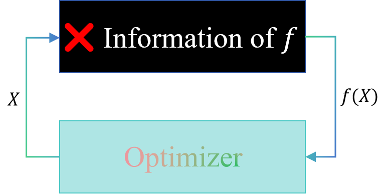

📦️This is a collection of [MetaBBO papers and their corresponding code resources](#content) (👈️Click here for the paper list).
## 🤔What is BBO?

    
    Black Box Optimization (BBO) refers to a class of optimization problems where the objective function is defined as $f: X \rightarrow \mathbb{R}$. The term "Black-Box" means that, although we can evaluate $f(X)$ for any $X$ within the search domain, we have no access to additional information such as the mathematical expression, gradients, or any structural details. The only available data comes from the input $X$ and the corresponding output $f(X)$. BBO problems can be categorized into combinatorial (CO), continuous (COP), discrete (DOP), single-objective (SOP), multi-objective (MOOP), and multi-modal optimization problem (MMOP), based on their specific characteristics.

## 🤨What is MetaBBO?
🔥Meta-Black-Box-Optimization (MetaBBO) is an emerging research topic, leveraging the generalization power of Meta Learning to enhance the performance of existing BBO optimizers. 🚀By utilizing Meta Learning, the reliance on expert-level knowledge is reduced, highlighting the trend toward autonomous algorithm design in BBO.

<!--使用quickchart来生成动态图表，方便随时调整-->

<!--🚩We warmly invite you to read our survey on MetaBBO, "[Toward Autonomous Algorithm Design: A Survey and Empirical Evaluation of Meta-Black-Box-Optimization]()," for more detailed insights into MetaBBO!-->

<!--## 😁Contact Us

👨‍💻👩‍💻We are a research team mainly focus on the Evolutionary Computation, Black Box Optimization and Meta Black Box Optimization. 

Here is our [homepage](https://gmc-drl.github.io/) and [github](https://github.com/GMC-DRL). **🥰🥰🥰Please feel free to contact us—any suggestions are welcome!**

✨️MetaBBO is rapidly evolving, and this is by no means a comprehensive list of papers.

If you want to update the list or have any question：
- 🌱Fork, Add, and Merge
- ❓️Report an [issue](https://github.com/GMC-DRL/Awesome-MetaBBO/issues)
- 📧Contact WenJie Qiu ([wukongqwj@gmail.com](mailto:wukongqwj@gmail.com))

😘Join us in perfecting the MetaBBO papers and their code resources together!-->

## 🌍️Useful Github Repository
👍️👍️👍️Many outstanding teams have developed excellent GitHub repositories for the Evolutionary Computation community, and we are pleased to share them here.
|Repository|About|
|:-:|:-:|
|[MetaBox](https://github.com/GMC-DRL/MetaBox)|MetaBox: A Benchmark Platform for Meta-Black-Box Optimization with Reinforcement Learning|
|[LLM4Opt](https://github.com/FeiLiu36/LLM4Opt)|A Collection on Large Language Models for Optimization|
|[pypop7](https://github.com/Wukong-SCUT/pypop)|A Pure-Python Library for POPulation-based Black-Box Optimization|
|[EvoX](https://github.com/EMI-Group/evox)|Distributed GPU-Accelerated Framework for Evolutionary Computation. Comprehensive Library of Evolutionary Algorithms & Benchmark Problems|
|[evosax](https://github.com/RobertTLange/evosax)|Evolution Strategies in JAX |

# Content
We first classify them by learning paradigm, followed by different autonomous algorithm design tasks. 

All papers are sorted by year of publication.

- 📝 [1. Survey Papers & Benchmarks](#1-survey-papers--benchmarks)
  - 📚[1.1. Survey Papers](#11-survey-papers)
  - 🔍[1.2. Benchmarks](#12-benchmarks)

- 🎯[2. MetaBBO](#2-metabbo)
  

    
🤖 2.1 MetaBBO via Reinforcement Learning

    
    - [2.1.1. Algorithm Selection](#211-algorithm-selection)
    - [2.1.2. Algorithm Configuration](#212-algorithm-configuration)
    - [2.1.3. Algorithm Generation](#213-algorithm-generation)
    - [2.1.4. Algorithm Imitation](#214-algorithm-imitation)
  

  

    
💻 2.2 MetaBBO via Supervised Learning

    
    - [2.2.1. Algorithm Selection](#221-algorithm-selection)
    - [2.2.2. Algorithm Configuration](#222-algorithm-configuration)
    - [2.2.3. Algorithm Imitation](#223-algorithm-imitation)

  

  

    
🧬 2.3 MetaBBO via Neuroevolution

    

    - [2.3.1. Algorithm Configuration](#231-algorithm-configuration)
    - [2.3.2. Algorithm Imitation](#232-algorithm-imitation)

  

  

    
🧠 2.4 MetaBBO via In-Context Learning

    
    - [2.4.1. Algorithm Selection](#241-algorithm-selection)
    - [2.4.2. Algorithm Generation](#242-algorithm-generation)
    - [2.4.3. Algorithm Imitation](#243-algorithm-imitation)

  

  - 🔧[3. Others](#3-others)
    - 📈[3.1 Evaluation Indicator](#31-evaluation-indicator)
    - 📊[3.2 Landscape Feature](#32-landscape-feature)

## 1. 📝Survey Papers \& Benchmarks

### 1.1. 📚Survey Papers

|Paper|
|:-:|
|Wu X, Wu S, Wu J, et al. "[**Evolutionary computation in the era of large language model: Survey and roadmap**](https://arxiv.org/abs/2401.10034)". arXiv preprint arXiv:2401.10034 (2024).|
|Song, Xingyou, et al. "[**Position: Leverage Foundational Models for Black-Box Optimization**](https://openreview.net/forum?id=ea2MgKn3sV)" Forty-first International Conference on Machine Learning (2024)|
|Huang, Sen, et al. "[**When Large Language Model Meets Optimization**](https://arxiv.org/abs/2405.10098)" arXiv preprint arXiv:2405.10098 (2024).|
|Sun Q, Chen Z, Xu F, et al. "[**A Survey of Neural Code Intelligence: Paradigms, Advances and Beyond**](https://openreview.net/forum?id=lH99v8c72g)". CoRR, (2024).|
|Huang S, Yang K, Qi S, et al. "[**When Large Language Model Meets Optimization**](https://arxiv.org/abs/2405.10098)". arXiv preprint arXiv:2405.10098 (2024).|
|Li P, Hao J, Tang H, et al. "[**Bridging Evolutionary Algorithms and Reinforcement Learning: A Comprehensive Survey on Hybrid Algorithms**](https://ieeexplore.ieee.org/abstract/document/10637292). IEEE Transactions on Evolutionary Computation. (2024).
|Song Y, Wu Y, Guo Y, et al. "[**Reinforcement learning-assisted evolutionary algorithm: A survey and research opportunities**](https://www.sciencedirect.com/science/article/pii/S2210650224000506). Swarm and Evolutionary Computation. (2024).
|Nikolikj, Ana, et al. "[**Quantifying Individual and Joint Module Impact in Modular Optimization Frameworks**](https://arxiv.org/abs/2405.11964)." 2024 IEEE Congress on Evolutionary Computation. (2024).
|Qian, Chao, Ke Xue, and Ren-Jian Wang. "[**Quality-Diversity Algorithms Can Provably Be Helpful for Optimization**](https://arxiv.org/abs/2401.10539)." arXiv preprint arXiv:2401.10539. (2024).
|Huang, Beichen, et al. "[**Exploring the True Potential: Evaluating the Black-box Optimization Capability of Large Language Models**](https://arxiv.org/abs/2404.06290)." arXiv preprint arXiv:2404.06290. (2024).
|Zhao Q, Duan Q, Yan B, et al. "[**Automated Design of Metaheuristic Algorithms: A Survey**](https://openreview.net/forum?id=qhtHsvF5zj)". Transactions on Machine Learning Research (2023).|
|Chernigovskaya, Maria, Andrey Kharitonov, and Klaus Turowski. "[**A Recent Publications Survey on Reinforcement Learning for Selecting Parameters of Meta-Heuristic and Machine Learning Algorithms**](https://www.scitepress.org/Papers/2023/119543/119543.pdf)." CLOSER. (2023).|
|Banzhaf W, Machado P. "[**Fundamentals of Evolutionary Machine Learning**](https://link.springer.com/chapter/10.1007/978-981-99-3814-8_1)" Handbook of Evolutionary Machine Learning. (2023).|
|Drugan, Madalina M. "[**Reinforcement learning versus evolutionary computation: A survey on hybrid algorithms**](https://www.sciencedirect.com/science/article/abs/pii/S2210650217302766)." Swarm and Evolutionary Computation. (2019).
|Stützle T, López-Ibáñez M. "[**Automated design of metaheuristic algorithms**](https://link.springer.com/chapter/10.1007/978-3-319-91086-4_17)". Handbook of metaheuristics (2019).|

### 1.2. 🔍Benchmarks

|Benchmark|Paper|Code Resource|Optimization Type|
|:-:|:-:|:-:|:-:|
|GP-based|He Y, Aranha C. "[**Evolving Benchmark Functions to Compare Evolutionary Algorithms via Genetic Programming**](https://arxiv.org/abs/2403.14146)". arXiv preprint arXiv:2403.14146 (2024).|[GP-based](https://github.com/Y1fanHE/cec2024)|COP|
|SELECTOR|Benjamins C, Cenikj G, Nikolikj A, et al. "[**Instance selection for dynamic algorithm configuration with reinforcement learning: Improving generalization**](https://dl.acm.org/doi/abs/10.1145/3638530.3654291)" Proceedings of the Genetic and Evolutionary Computation Conference Companion. (2024).|[automl/instance-dac]( https://github.com/automl/instance-dac)|DAC|
|MetaBox|Ma, Zeyuan, et al. "[**MetaBox: A Benchmark Platform for Meta-Black-Box Optimization with Reinforcement Learning**](https://neurips.cc/virtual/2023/oral/73737)." Advances in Neural Information Processing Systems 36 (2023).|[GMC-DRL/MetaBox]( https://github.com/GMC-DRL/MetaBox)|Comprehensive platform|
|NN-based|Prager R P, Dietrich K, Schneider L, et al. "[**Neural Networks as Black-Box Benchmark Functions Optimized for Exploratory Landscape Features**](https://dl.acm.org/doi/abs/10.1145/3594805.3607136)" Proceedings of the 17th ACM/SIGEVO Conference on Foundations of Genetic Algorithms (2023).| - |COP|
|NeuroEvoBench|Lange, Robert, Yujin Tang, and Yingtao Tian. "[**Neuroevobench: Benchmarking evolutionary optimizers for deep learning applications**](https://neurips.cc/virtual/2023/oral/73737)." Advances in Neural Information Processing Systems 36 (2023)|[neuroevobench/neuroevobench](https://github.com/neuroevobench/neuroevobench)|Comprehensive platform|
|MA-BBOB|Vermetten D, Ye F, Bäck T, et al. "[**MA-BBOB: A problem generator for black-box optimization using affine combinations and shifts**](https://dl.acm.org/doi/abs/10.1145/3673908)". ACM Transactions on Evolutionary Learning, (2024).|[Dvermetten/Many-affine-BBOB](https://github.com/Dvermetten/Many-affine-BBOB)|COP|
|IEEE CEC 2022|Abhishek Kumar, Kenneth V. Price, Ali Wagdy Mohamed, Anas A. Hadi, P. N. Suganthan, "[**Problem definitions and evaluation criteria for the cec 2022 Special Session and Competition on Single Objective Bound Constrained Numerical Optimization**](https://www3.ntu.edu.sg/home/epnsugan/index_files/CEC2022/CEC2022.htm)." Technical Report 2022|[P-N-Suganthan/2022-SO-BO](https://github.com/P-N-Suganthan/2022-SO-BO)|COP|
|Affine Recombination|Dietrich K, Mersmann O. "[**Increasing the diversity of benchmark function sets through affine recombination**](https://link.springer.com/chapter/10.1007/978-3-031-14714-2_41)" International Conference on Parallel Problem Solving from Nature. (2022).| - |COP|
|IEEE CEC 2021|Ali Wagdy, Anas A Hadi, Ali K. Mohamed, Prachi Agrawal, Abhishek Kumar and P. N. Suganthan, "[**Problem definitions and evaluation criteria for the cec 2021 Special Session and Competition on Single Objective Bound Constrained Numerical Optimization**](https://www3.ntu.edu.sg/home/epnsugan/index_files/CEC2021/CEC2021-2.htm)." Technical Report 2021|[P-N-Suganthan/2021-SO-BCO](https://github.com/P-N-Suganthan/2021-SO-BCO)|COP|
|Zigzag BBO|Kudela, Jakub. "[**Novel zigzag-based benchmark functions for bound constrained single objective optimization**](https://ieeexplore.ieee.org/abstract/document/9504720/)." 2021 IEEE Congress on Evolutionary Computation . IEEE, (2021). Kudela, Jakub, and Radomil Matousek. "[**New benchmark functions for single-objective optimization based on a zigzag pattern**](https://ieeexplore.ieee.org/abstract/document/9684455/)." IEEE Access 10 (2022).|[JakubKudela89/Zigzag](https://github.com/JakubKudela89/Zigzag)|COP|
|HPOBench|Eggensperger, Katharina, et al. "[**HPOBench: A collection of reproducible multi-fidelity benchmark problems for HPO**](https://arxiv.org/abs/2109.06716)." arXiv preprint arXiv:2109.06716 (2021).|[automl/HPOBench](https://github.com/automl/HPOBench)|COP|
|DACBench|Eimer, Theresa, et al. "[**DACBench: A benchmark library for dynamic algorithm configuration**](https://arxiv.org/abs/2105.08541)." arXiv preprint arXiv:2105.08541 (2021).|[automl/DACBench](https://github.com/automl/DACBench)|DAC|
|Olympus|Häse, Florian, et al. "[**Olympus: a benchmarking framework for noisy optimization and experiment planning**](https://iopscience.iop.org/article/10.1088/2632-2153/abedc8/meta)." Machine Learning: Science and Technology (2021).|[aspuru-guzik-group/olympus](https://github.com/aspuru-guzik-group/olympus)|SOP, MOOP|
|NeurIPS BBO challenge|Turner R, Eriksson D, McCourt M, et al. "[**Bayesian optimization is superior to random search for machine learning hyperparameter tuning: Analysis of the black-box optimization challenge 2020**](https://proceedings.mlr.press/v133/turner21a.html)" NeurIPS 2020 Competition and Demonstration Track. (2021)|[NeurIPS BBO challenge](https://github.com/rdturnermtl/bbo_challenge_starter_kit/) |SOP|
|Random function generator|Tian Y, Peng S, Zhang X, et al. "[**A recommender system for metaheuristic algorithms for continuous optimization based on deep recurrent neural networks**](https://ieeexplore.ieee.org/abstract/document/9187549)". IEEE transactions on artificial intelligence (2020).|[Random function generator](https://github.com/BIMK/Algorithm-Recommendation) |COP|
|CEC 2020 competition on real-world optimization problem|Kumar A, Wu G, Ali M Z, et al. "[**A test-suite of non-convex constrained optimization problems from the real-world and some baseline results**](https://www.sciencedirect.com/science/article/pii/S2210650219308946). Swarm and Evolutionary Computation (2020).|[CEC 2020 real-world](https://github.com/P-N-Suganthan/2020-RW-Constrained-Optimisation)|-|
|COCO|Hansen, Nikolaus, et al. "[**COCO: A platform for comparing continuous optimizers in a black-box setting**](https://www.tandfonline.com/doi/abs/10.1080/10556788.2020.1808977)." Optimization Methods and Software (2021).|[numbbo/coco](https://github.com/numbbo/coco)|COP|
|EVOBBO|Muñoz, Mario A., and Kate Smith-Miles. "[**Generating new space-filling test instances for continuous black-box optimization**](https://direct.mit.edu/evco/article-abstract/28/3/379/94997)." Evolutionary computation (2020).|[andremun/EVOBBO_Instances](https://github.com/andremun/EVOBBO_Instances)|COP|
|Bayesmark|Turner R, Eriksson D. "[**Bayesmark: Benchmark framework to easily compare bayesian optimization methods on real machine learning tasks**](https://bayesmark.readthedocs.io/en/latest/)." (2019). |[Bayesmark](https://github.com/uber/bayesmark)|SOP|
|PBO|Doerr C, Ye F, Horesh N, et al. "[**Benchmarking discrete optimization heuristics with IOHprofiler**](https://dl.acm.org/doi/abs/10.1145/3319619.3326810)" Proceedings of the Genetic and Evolutionary Computation Conference Companion. (2019).|[PBO](https://github.com/IOHprofiler/IOHdata)|DOP|
|IOHprofiler (IOHexperimenter)|Doerr, Carola, et al. "[**IOHprofiler: A benchmarking and profiling tool for iterative optimization heuristics**](https://arxiv.org/abs/1810.05281)." arXiv preprint arXiv:1810.05281 (2018). de Nobel, Jacob, et al. "[**Iohexperimenter: Benchmarking platform for iterative optimization heuristics**](https://direct.mit.edu/evco/article/doi/10.1162/evco_a_00342/116949)." Evolutionary Computation (2023): 1-6.|[IOHprofiler/ IOHexperimenter](https://github.com/IOHprofiler/IOHexperimenter)|Comprehensive platform|
|MTMOOP|Yuan Y, Ong Y S, Feng L, et al. "[**Evolutionary multitasking for multiobjective continuous optimization: Benchmark problems, performance metrics and baseline results**](https://arxiv.org/abs/1706.02766)." arXiv preprint arXiv:1706.02766 (2017).|- |MTMO|
|MTSOP|Da B, Ong Y S, Feng L, et al. "[**Evolutionary multitasking for single-objective continuous optimization: Benchmark problems, performance metric, and baseline results**](https://arxiv.org/abs/1706.03470)". arXiv preprint arXiv:1706.03470 (2017).|- |MTSO|
|IEEE CEC 2017|N. H. Awad, M. Z. Ali, J. J. Liang, B. Y. Qu and P. N. Suganthan, "[**Problem definitions and evaluation criteria for the CEC 2017 competition on constrained real-parameter optimization**](https://www3.ntu.edu.sg/home/epnsugan/index_files/CEC2017/CEC2017.htm)." Technical Report (2017)|[P-N-Suganthan/CEC2017-BoundContrained](https://github.com/P-N-Suganthan/CEC2017-BoundContrained)|COP|
|IEEE CEC 2015|J. J. Liang, B. Y. Qu, P. N. Suganthan, Q. Chen, "[**Problem Definitions and Evaluation Criteria for the CEC 2015 Competition on Learning-based Real-Parameter Single Objective Optimization**](https://www3.ntu.edu.sg/home/epnsugan/index_files/CEC2015/CEC2015.htm)", Technical Report, Computational Intelligence Laboratory (2015).|[P-N-Suganthan/CEC2015-Learning-Based](https://github.com/P-N-Suganthan/CEC2015-Learning-Based)|COP|
|AClib|Hutter, Frank, et al. "[**AClib: A benchmark library for algorithm configuration**](https://link.springer.com/chapter/10.1007/978-3-319-09584-4_4)." Learning and Intelligent Optimization: 8th International Conference (2014).|[aclib.net](https://www.aclib.net/)|-|
|IEEE CEC 2013|J. J. Liang, B-Y. Qu, P. N. Suganthan, Alfredo G. Hernández-Díaz, "[**Problem Definitions and Evaluation Criteria for the CEC 2013 Special Session and Competition on Real-Parameter Optimization**](https://www3.ntu.edu.sg/home/epnsugan/index_files/CEC2013/CEC2013.htm)", Technical Report, Computational Intelligence Laboratory (2013).|[P-N-Suganthan/CEC2013](https://github.com/P-N-Suganthan/CEC2013)|COP|
|Protein–Docking|Hwang, Howook, et al. "[**Protein–protein docking benchmark version 4.0**](https://onlinelibrary.wiley.com/doi/abs/10.1002/prot.22830)." Proteins: Structure, Function, and Bioinformatics (2010).|[Protein–Docking](http://zlab.umassmed.edu/benchmark/)|-|
|BBOB 2009|Hansen N, Finck S, Ros R, et al. "[**Real-parameter black-box optimization benchmarking 2009: Noiseless functions definitions**](https://inria.hal.science/inria-00362633/)". INRIA. (2009). |[BBOB 2009](https://web.archive.org/web/20200811021008/https://coco.gforge.inria.fr/doku.php?id=bbob-2009-results) |COP|
|WFG|Huband S, Hingston P, Barone L, et al. "[**A review of multiobjective test problems and a scalable test problem toolkit**](https://ieeexplore.ieee.org/abstract/document/1705400)." IEEE Transactions on Evolutionary Computation. (2006).|[WFG](https://github.com/White-Chen/MOEA-Benchmark) |MOOP|
|DTLZ|Deb K, Thiele L, Laumanns M, et al. "[**Scalable multi-objective optimization test problems**](https://ieeexplore.ieee.org/abstract/document/1007032)." Proceedings of the 2002 Congress on Evolutionary Computation (2002).|[DTLZ](https://github.com/msu-coinlab/pymop/tree/master?tab=readme-ov-file) |MOOP|
|ZDT|Zitzler, E., Deb, K., and Thiele, L. "[**Comparison of Multiobjective Evolutionary Algorithms: Empirical Results**]( https://dl.acm.org/doi/10.1162/106365600568202)." Evolutionary Computation (2000). |[ZDT](https://github.com/White-Chen/MOEA-Benchmark)|MOOP|

**The complete list of IEEE CEC series can be access at [ntu.edu.sg](https://www3.ntu.edu.sg/home/epnsugan/index_files/).*

**The complete list of BBOB series can be access at [numbbo](https://numbbo.github.io/workshops/bbob2023.html).*

<a href="https://github.com/GMC-DRL/Awesome-MetaBBO/tree/main#awesome-metabbo">Back to Top</a>

## 2. 🎯MetaBBO

### 2.1 🤖MetaBBO-RL
#### 2.1.1 Algorithm Selection
|Algorithm|Paper|Optimization Type|Low-Level Optimizer|RL|Code Resource|
|:-:|:-:|:-:|:-:|:-:|:-:|
|HHRL-MAR|Zhu N, Zhao F, Cao J. "[**A Hyperheuristic and Reinforcement Learning Guided Meta-heuristic Algorithm Recommendation**](https://ieeexplore.ieee.org/abstract/document/10580058/)" 2024 27th International Conference on Computer Supported Cooperative Work in Design (2024)|SOP|SI|Tabular Q-learning|-|
|R2-RLMOEA|Tahernezhad-Javazm F, Rankin D, Bois N D, et al. "[**R2 Indicator and Deep Reinforcement Learning Enhanced Adaptive Multi-Objective Evolutionary Algorithm**](https://arxiv.org/abs/2404.08161)". arXiv preprint arXiv:2404.08161 (2024).|MOOP|EAs|DDQN|-|
|RL-DAS|Guo, Hongshu, et al. "[**Deep Reinforcement Learning for Dynamic Algorithm Selection: A Proof-of-Principle Study on Differential Evolution**](https://ieeexplore.ieee.org/abstract/document/10496708/)." IEEE Transactions on Systems, Man, and Cybernetics: Systems (2024).|SOP|DE|PPO|-|

#### 2.1.2 Algorithm Configuration

|Algorithm|Paper|Optimization Type|Low-Level Optimizer|RL|Code Resource|
|:-:|:-:|:-:|:-:|:-:|:-:|
|HF|Pei J, Liu J, Mei Y. "[**Learning from Offline and Online Experiences: A Hybrid Adaptive Operator Selection Framework**](https://dl.acm.org/doi/abs/10.1145/3638529.3654062)" Proceedings of the Genetic and Evolutionary Computation Conference. (2024).|SOP, COP|DE|DDQN|-|
|UES-CMAES-RL|Bolufé-Röhler A, Xu B. "[**Deep Reinforcement Learning for Smart Restarts in Exploration-Only Exploitation-Only Hybrid Metaheuristics Metaheuristics International Conference**](https://link.springer.com/chapter/10.1007/978-3-031-62922-8_2)" (2024).|SOP|UES-CMAES|DQN|-|
|MTDE-L2T|Wu S H, Huang Y, Wu X, et al. "[**Learning to Transfer for Evolutionary Multitasking**](https://arxiv.org/abs/2406.14359)". arXiv preprint arXiv:2406.14359, (2024).|MTOP|EC|PPO|-|
|MSoRL|Wang X, Wang F, He Q, et al. "[**A multi-swarm optimizer with a reinforcement learning mechanism for large-scale optimization**](https://www.sciencedirect.com/science/article/pii/S2210650224000191)". Swarm and Evolutionary Computation (2024).|LSOP|PSO|Tabular Q-learning|-|
|MRL-MOEA|Wang, Jing, et al. "[**A Novel Multi-State Reinforcement Learning-Based Multi-Objective Evolutionary Algorithm**](https://www.sciencedirect.com/science/article/pii/S0020025524013112)." Information Sciences (2024).|MOOP|MOEA|Tabular Q-learning|-|
|RLEMMO|Lian, Hongqiao, et al. "[**RLEMMO: Evolutionary Multimodal Optimization Assisted By Deep Reinforcement Learning**](https://dl.acm.org/doi/abs/10.1145/3638529.3653995)." Proceedings of the Genetic and Evolutionary Computation Conference (2024).|MMOP|DE|PPO|-|
|SA-DQN-DE|Liao, Zuowen, Qishuo Pang, and Qiong Gu. "[**Differential evolution based on strategy adaptation and deep reinforcement learning for multimodal optimization problems**](https://www.sciencedirect.com/science/article/pii/S2210650224001068)." Swarm and Evolutionary Computation 87 (2024): 101568.|MMOP|DE|DQN|-|
|PG-DE \& PG-MPEDE|Zhang, Haotian, et al. "[**Learning to select the recombination operator for derivative-free optimization**](https://link.springer.com/article/10.1007/s11425-023-2252-9)." Science China Mathematics (2024).|SOP|DE|REINFORCE|-|
|RLNS|Hong, Jiale, Bo Shen, and Anqi Pan. "[**A reinforcement learning-based neighborhood search operator for multi-modal optimization and its applications**](https://www.sciencedirect.com/science/article/pii/S0957417424000150)." Expert Systems with Applications (2024).|MMOP|SSA,PSO,EO|Tabular Q-learning|-|
|RLMODE|Yu, Xiaobing, et al. "[**Reinforcement learning-based differential evolution algorithm for constrained multi-objective optimization problems**](https://www.sciencedirect.com/science/article/pii/S0952197623020018)." Engineering Applications of Artificial Intelligence (2024).|MOOP|DE|Tabular Q-learning|-|
|GLEET|Ma, Zeyuan, et al. "[**Auto-configuring Exploration-Exploitation Tradeoff in Evolutionary Computation via Deep Reinforcement Learning**](https://dl.acm.org/doi/abs/10.1145/3638529.3653996)." Proceedings of the Genetic and Evolutionary Computation Conference (2024).|SOP|DE,PSO|PPO|-|
|RLHDE|Peng L, Yuan Z, Dai G, et al. "[**Reinforcement learning-based hybrid differential evolution for global optimization of interplanetary trajectory design**](https://www.sciencedirect.com/science/article/pii/S2210650223001244)". Swarm and Evolutionary Computation, (2023).|SOP|HLSHADE|Tabular Q-learning|-|
|AMODE-DRL|Li T, Meng Y, Tang L. "[**Scheduling of continuous annealing with a multi-objective differential evolution algorithm based on deep reinforcement learning**](https://ieeexplore.ieee.org/abstract/document/10049395)". IEEE Transactions on Automation Science and Engineering (2023).|MOOP|MODE|DDQN+DDPG|-|
|MARLABC|Zhao F, Wang Z, Wang L, et al. "[**A multi-agent reinforcement learning driven artificial bee colony algorithm with the central controller**](https://www.sciencedirect.com/science/article/pii/S0957417423001732)". Expert Systems with Applications (2023).|SOP|ABC|Tabular Q-learning|-|
|CEDE-DRL|Hu Z, Gong W, Pedrycz W, et al. "[**Deep reinforcement learning assisted co-evolutionary differential evolution for constrained optimization**](https://www.sciencedirect.com/science/article/pii/S2210650223001608)". Swarm and Evolutionary Computation (2023).|COP|CO-DE|DQN|-|
|RLDMDE|Yang, Qingyong, et al. "[**Dynamic multi-strategy integrated differential evolution algorithm based on reinforcement learning for optimization problems**](https://link.springer.com/article/10.1007/s40747-023-01243-9)." Complex & Intelligent Systems (2023).|SOP|DE|Tabular Q-learning|-|
|RLMMDE|Han Y, Peng H, Mei C, et al. "[**Multi-strategy multi-objective differential evolutionary algorithm with reinforcement learning**](https://www.sciencedirect.com/science/article/pii/S0950705123005518)". Knowledge-Based Systems (2023).|MOOP|MOEA|Tabular Q-learning|-|
|MPSORL|Meng, Xiaoding, Hecheng Li, and Anshan Chen. "[**Multi-strategy self-learning particle swarm optimization algorithm based on reinforcement learning**](http://www.aimspress.com/aimspress-data/mbe/2023/5/PDF/mbe-20-05-373.pdf)." Mathematical Biosciences and Engineering (2023).|SOP|PSO|Tabular Q-learning|-|
|IRLMFO|Zhao F, Wang Q, Wang L. "[**An inverse reinforcement learning framework with the Q-learning mechanism for the metaheuristic algorithm**](https://www.sciencedirect.com/science/article/pii/S0950705123001181)". Knowledge-Based Systems (2023).|SOP|MFO|IRL+Tabual Q-learning|-|
|RLAM|Yin, Shiyuan, et al. "[**Reinforcement-learning-based parameter adaptation method for particle swarm optimization**](https://link.springer.com/article/10.1007/s40747-023-01012-8)." Complex & Intelligent Systems (2023).|SOP|PSO|DDPG|-|
|LADE|Liu X, Sun J, Zhang Q, et al. "[**Learning to learn evolutionary algorithm: A learnable differential evolution**](https://ieeexplore.ieee.org/abstract/document/10068274/)". IEEE Transactions on Emerging Topics in Computational Intelligence (2023).|SOP|DE|REINFORCE|-|
|MOEADRL|Gao, Mengqi, et al. "[**An efficient evolutionary algorithm based on deep reinforcement learning for large-scale sparse multiobjective optimization**](https://link.springer.com/article/10.1007/s10489-023-04574-9)." Applied Intelligence (2023).|LS-MOOP|SpareEAs|A2C|-|
|Q-LSHADE|Zhang H, Sun J, Bäck T, et al. "[**Controlling Sequential Hybrid Evolutionary Algorithm by Q-Learning**](https://ieeexplore.ieee.org/abstract/document/10035716/)". IEEE Computational Intelligence Magazine (2023).|SOP|LSHADE|Tabular Q-learning|-|
|NRLPSO|Li, Wei, et al. "[**Reinforcement learning-based particle swarm optimization with neighborhood differential mutation strategy**](https://www.sciencedirect.com/science/article/pii/S2210650223000482)." Swarm and Evolutionary Computation (2023).|SOP|PSO|Tabular Q-learning|-|
|RL-SHADE|Fister I, Fister D, Fister Jr I. "[**Reinforcement learning-based differential evolution for global optimization Differential Evolution: From Theory to Practice**](https://link.springer.com/chapter/10.1007/978-981-16-8082-3_3)" (2022).|SOP|SHADE|Tabular Q-learning|-|
|RL-HPSDE|Tan, Zhiping, et al. "[**Differential evolution with hybrid parameters and mutation strategies based on reinforcement learning**](https://www.sciencedirect.com/science/article/pii/S2210650222001602)." Swarm and Evolutionary Computation (2022): 101194.|SOP|DE|Tabular Q-learning|-|
|MOEA/D-DQN|Tian, Ye, et al. "[**Deep reinforcement learning based adaptive operator selection for evolutionary multi-objective optimization**](https://ieeexplore.ieee.org/abstract/document/9712324/)." IEEE Transactions on Emerging Topics in Computational Intelligence (2022).|MOOP|MOEA|DDQN|-|
|RL-CORCO|Hu Z, Gong W. "[**Constrained evolutionary optimization based on reinforcement learning using the objective function and constraints**](https://www.sciencedirect.com/science/article/pii/S0950705121009709)". Knowledge-Based Systems (2022).|COP|DE|Tabular Q-learning|-|
|MADAC|Xue, Ke, et al. "[**Multi-agent dynamic algorithm configuration**](https://proceedings.neurips.cc/paper_files/paper/2022/hash/7f02b39c0424cc4a422994289ca03e46-Abstract-Conference.html)." Advances in Neural Information Processing Systems (2022).|MOOP|MOEA/D|VDN|-|
|RLLPSO|Wang F, Wang X, Sun S. "[**A reinforcement learning level-based particle swarm optimization algorithm for large-scale optimization**](https://www.sciencedirect.com/science/article/pii/S0020025522004054)." Information Sciences (2022).|LSOP|PSO|Tabular Q-learning|-|
|RL-PSO|Wu, Di, and G. Gary Wang. "[**Employing reinforcement learning to enhance particle swarm optimization methods**](https://www.tandfonline.com/doi/abs/10.1080/0305215X.2020.1867120)." Engineering Optimization (2022).|SOP|PSO|REINFORCE|-|
|RLEA-SSC|Xia H, Li C, Zeng S, et al. "[**A reinforcement-learning-based evolutionary algorithm using solution space clustering for multimodal optimization problems**](https://ieeexplore.ieee.org/abstract/document/9504896) 2021 IEEE Congress on Evolutionary Computation (CEC). (2021).|MMOP|DE|Tabular Q-learning|-|
|DE-DQN|Tan, Zhiping, and Kangshun Li. "[**Differential evolution with mixed mutation strategy based on deep reinforcement learning**](https://www.sciencedirect.com/science/article/abs/pii/S1568494621005998)." Applied Soft Computing (2021).|SOP|DE|Tabular Q-learning|-|
|LDE|Sun, Jianyong, et al. "[**Learning Adaptive Differential Evolution Algorithm from Optimization Experiences by Policy Gradient**](https://ieeexplore.ieee.org/abstract/document/9359652)." IEEE Transactions on Evolutionary Computation (2021).|SOP|DE|REINFORCE|[yierh/LDE](https://github.com/yierh/LDE)|
|RLEPSO|Yin, Shiyuan, et al. "[**RLEPSO: Reinforcement learning based Ensemble particle swarm optimizer**](https://dl.acm.org/doi/abs/10.1145/3508546.3508599)." Proceedings of the 2021 4th International Conference on Algorithms, Computing and Artificial Intelligence. (2021).|SOP|PSO|DDPG|-|
|RLDE|Hu Z, Gong W, Li S. "[**Reinforcement learning-based differential evolution for parameters extraction of photovoltaic models**](https://www.sciencedirect.com/science/article/pii/S2352484721000974)." Energy Reports (2021).|SOP|DE|Tabular Q-learning|-|
|LRMODE|Huang Y, Li W, Tian F, et al. "[**A fitness landscape ruggedness multiobjective differential evolution algorithm with a reinforcement learning strategy**](https://www.sciencedirect.com/science/article/pii/S1568494620306311)". Applied Soft Computing (2020).|MOOP|DE|Tabular Q-learning|-|
|MARLwCMA|Sallam, Karam M., et al. "[**Evolutionary framework with reinforcement learning-based mutation adaptation**](https://ieeexplore.ieee.org/abstract/document/9239320/)." IEEE Access (2020).|SOP|DE|Tabular Q-learning|-|
|QLPSO|Xu Y, Pi D. "[**A reinforcement learning-based communication topology in particle swarm optimization**](https://link.springer.com/article/10.1007/s00521-019-04527-9)." Neural Computing and Applications (2020).|SOP|PSO|Tabular Q-learning|-|
|LTO|Shala G, Biedenkapp A, Awad N, et al. "[**Learning step-size adaptation in CMA-ES**](https://link.springer.com/chapter/10.1007/978-3-030-58112-1_48)." Parallel Problem Solving from Nature–PPSN XVI: 16th International Conference (2020).|SOP|CMA-ES|GPS|-|
|DE-DDQN|Sharma, Mudita, et al. "[**Deep reinforcement learning based parameter control in differential evolution**](https://dl.acm.org/doi/abs/10.1145/3321707.3321813)." Proceedings of the Genetic and Evolutionary Computation Conference (2019).|SOP|DE|Tabular Q-learning|[mudita11/DE-DDQN](https://github.com/mudita11/DE-DDQN)|
|QL-M/S-OPSO|Liu Y, Lu H, Cheng S, et al. "[**An adaptive online parameter control algorithm for particle swarm optimization based on reinforcement learning**](https://ieeexplore.ieee.org/abstract/document/8790035)" 2019 IEEE congress on evolutionary computation (2019).|MO/SOP|PSO|Tabular Q-learning|-|
|RL-MOEA/D|Ning W, Guo B, Guo X, et al. "[**Reinforcement learning aided parameter control in multi-objective evolutionary algorithm based on decomposition**](https://link.springer.com/article/10.1007/s13748-018-0155-7)". Progress in Artificial Intelligence (2018).|MOOP|MOEA/D|SARSA|-|
|QFA|Sadhu A K, Konar A, Bhattacharjee T, et al. "[**Synergism of firefly algorithm and Q-learning for robot arm path planning**](https://www.sciencedirect.com/science/article/pii/S2210650217306776)". Swarm and Evolutionary Computation (2018).|SOP|FA|Tabular Q-learning|-|
|RLMPSO|Samma H, Lim C P, Saleh J M. "[**A new reinforcement learning-based memetic particle swarm optimizer**](https://www.sciencedirect.com/science/article/pii/S1568494616000132)". Applied Soft Computing (2016).|SOP|PSO|Tabular Q-learning|-|

#### 2.1.3 Algorithm Generation
|Algorithm|Paper|Optimization Type|Low-Level Optimizer|RL|Code Resource|
|:-:|:-:|:-:|:-:|:-:|:-:|
|ALDes|Zhao, Qi, et al. "[**Automated Metaheuristic Algorithm Design with Autoregressive Learning**](https://arxiv.org/abs/2405.03419)." arXiv preprint arXiv:2405.03419 (2024).|SOP|-|-|-|
|SYMBOL|Chen, Jiacheng, et al. "[**Symbol: Generating Flexible Black-Box Optimizers through Symbolic Equation Learning**](https://openreview.net/forum?id=vLJcd43U7a)." The Twelfth International Conference on Learning Representations. (2024).|SOP|-|PPO|[SYMBOL](https://github.com/GMC-DRL/Symbol)|

#### 2.1.4 Algorithm Imitation
|Algorithm|Paper|Optimization Type|Low-Level Optimizer|RL|Code Resource|
|:-:|:-:|:-:|:-:|:-:|:-:|
|MELBA|Chaybouti, Sofian, et al. "[**Meta-learning of Black-box Solvers Using Deep Reinforcement Learning**](https://hal.science/hal-03930140/)." NeurIPS 2022, MetaLearn Workshop. (2022).|SOP|-|PPO|-|

<a href="https://github.com/GMC-DRL/Awesome-MetaBBO/tree/main#awesome-metabbo">Back to Top</a>

### 2.2 💻MetaBBO-SL
#### 2.2.1 Algorithm Selection
|Algorithm|Paper|Optimization Type|Low-Level Optimizer|Code Resource|
|:-:|:-:|:-:|:-:|:-:|
|TransOptAS|Cenikj G, Petelin G, Eftimov T. "[**TransOptAS: Transformer-Based Algorithm Selection for Single-Objective Optimization**](https://dl.acm.org/doi/abs/10.1145/3638530.3654191)" Proceedings of the Genetic and Evolutionary Computation Conference Companion (2024).|SOP|EAs,SI|-|
|ASF-ALLFV|Li Y, Liang J, Yu K, et al. "[**Adaptive local landscape feature vector for problem classification and algorithm selection**](https://www.sciencedirect.com/science/article/pii/S1568494622008006)". Applied Soft Computing, (2022).|SOP|EAs,SI|-|
|AR-BB|Tian Y, Peng S, Zhang X, et al. "[**A recommender system for metaheuristic algorithms for continuous optimization based on deep recurrent neural networks**](https://ieeexplore.ieee.org/abstract/document/9187549)". IEEE transactions on artificial intelligence (2020).|SOP|EAs,SI|-|
|Meta-VRP|Gutierrez-Rodríguez A E, Conant-Pablos S E, Ortiz-Bayliss J C, et al. "[**Selecting meta-heuristics for solving vehicle routing problems with time windows via meta-learning**](https://www.sciencedirect.com/science/article/pii/S0957417418306857)". Expert Systems with Applications (2019).|CO|MOEA|-|
|Meta-MOP|Tian Y, Peng S, Rodemann T, et al. "[**Automated selection of evolutionary multi-objective optimization algorithms**](https://ieeexplore.ieee.org/abstract/document/9003018)" 2019 IEEE Symposium Series on Computational Intelligence. (2019).|MOOP|MOEA|-|
|Meta-TSP|Kanda J Y, de Carvalho A C, Hruschka E R, et al. "[**Using meta-learning to recommend meta-heuristics for the traveling salesman problem**](https://ieeexplore.ieee.org/abstract/document/6146996)" 2011 10th international conference on machine learning and applications and workshops. (2011).|CO|GA|-|
|Meta-QAP|Smith-Miles K A. "[**Towards insightful algorithm selection for optimisation using meta-learning concepts**](https://ieeexplore.ieee.org/abstract/document/4634391)" 2008 IEEE international joint conference on neural networks. (2008).|CO|MMAS|-|

#### 2.2.2 Algorithm Configuration
|Algorithm|Paper|Optimization Type|Low-Level Optimizer|Code Resource|
|:-:|:-:|:-:|:-:|:-:|
|ada-smoDE|Zhang H, Shi J, Sun J, et al. "[**A Gradient-based Method for Differential Evolution Parameter Control by Smoothing**](https://dl.acm.org/doi/abs/10.1145/3638530.3654185)" Proceedings of the Genetic and Evolutionary Computation Conference Companion. (2024).|SOP|DE|-|

#### 2.2.3 Algorithm Imitation
|Algorithm|Paper|Optimization Type|Low-Level Optimizer|Code Resource|
|:-:|:-:|:-:|:-:|:-:|
|GLHF|Li, Xiaobin, et al. "[**GLHF: General Learned Evolutionary Algorithm Via Hyper Functions**](https://arxiv.org/abs/2405.03728)." arXiv preprint arXiv:2405.03728 (2024).|SOP|DE|-|
|EvoTF|Lange, Robert Tjarko, Yingtao Tian, and Yujin Tang. "[**Evolution Transformer: In-Context Evolutionary Optimization**](https://arxiv.org/abs/2403.02985)." arXiv preprint arXiv:2403.02985 (2024).|SOP|-|[RobertTLange/evosax](https://github.com/RobertTLange/evosax)|
|LEO-SL|Yu, Peiyu, et al. "[**Latent Energy-Based Odyssey: Black-Box Optimization via Expanded Exploration in the Energy-Based Latent Space**](https://arxiv.org/abs/2405.16730)." arXiv preprint arXiv:2405.16730 (2024).|SOP|-|-|
|RIBBO|Song, Lei, et al. "[**Reinforced In-Context Black-Box Optimization**](https://arxiv.org/abs/2402.17423)." arXiv preprint arXiv:2402.17423 (2024).|SOP|-|[RIBBO](https://github.com/songlei00/RIBBO)|
|NAP|Maraval, Alexandre, et al. "[**End-to-end meta-Bayesian optimisation with transformer neural processes**](https://proceedings.neurips.cc/paper_files/paper/2023/hash/2561721d0ca69bab22b749cfc4f48f6c-Abstract-Conference.html)." Advances in Neural Information Processing Systems 36 (2024).|SOP|-|-|
|B2Opt|Li X, Wu K, Zhang X, et al. "[**B2Opt: Learning to Optimize Black-box Optimization with Little Budget**](https://arxiv.org/abs/2304.11787)". arXiv preprint arXiv:2304.11787, (2023).|SOP|GA|-|
|RNN-Opt|TV, Vishnu, et al. "[**Meta-learning for black-box optimization**](https://link.springer.com/chapter/10.1007/978-3-030-46147-8_22)." Joint European Conference on Machine Learning and Knowledge Discovery in Databases. (2019).|SOP|-|-|
|RNN-OI|Chen, Yutian, et al. "[**Learning to learn without gradient descent by gradient descent**](http://proceedings.mlr.press/v70/chen17e.html)." International Conference on Machine Learning. PMLR (2017).|SOP|-|-|

<a href="https://github.com/GMC-DRL/Awesome-MetaBBO/tree/main#awesome-metabbo">Back to Top</a>

### 2.3 🧬MetaBBO-NE

#### 2.3.1 Algorithm Configuration
|Algorithm|Paper|Optimization Type|Low-Level Optimizer|Code Resource|
|:-:|:-:|:-:|:-:|:-:|
|LES|Lange, Robert, et al. "[**Discovering evolution strategies via meta-black-box optimization**](https://iclr.cc/virtual/2023/poster/11005)." The Eleventh International Conference on Learning Representations. (2023).|SOP|CMA-ES|[LES](https://github.com/RobertTLange/evosax/blob/main/evosax/strategies/les.py)|

#### 2.3.2 Algorithm Imitation
|Algorithm|Paper|Optimization Type|Low-Level Optimizer|Code Resource|
|:-:|:-:|:-:|:-:|:-:|
|LGA|Lange, Robert, et al. "[**Discovering attention-based genetic algorithms via meta-black-box optimization**](https://dl.acm.org/doi/abs/10.1145/3583131.3590496)." Proceedings of the Genetic and Evolutionary Computation Conference. (2023).|SOP|GA|[LGA](https://github.com/RobertTLange/evosax/blob/main/evosax/strategies/lga.py)|
|LTO-POMDP|Gomes H S, Léger B, Gagné C. "[**Meta learning black-box population-based optimizers**](https://arxiv.org/abs/2103.03526)". arXiv preprint arXiv:2103.03526 (2021).|SOP|-|[LTO-POMDP](https://github.com/optimization-toolbox/meta-learning-population-based-optimizers)|

<a href="https://github.com/GMC-DRL/Awesome-MetaBBO/tree/main#awesome-metabbo">Back to Top</a>

### 2.4 🧠MetaBBO-ICL
#### 2.4.1 Algorithm Selection
|Algorithm|Paper|Optimization Type|Low-Level Optimizer|Code Resource|
|:-:|:-:|:-:|:-:|:-:|
|AS-LLM|Wu, Xingyu, et al. "[**Large language model-enhanced algorithm selection: towards comprehensive algorithm representation**](https://ira.lib.polyu.edu.hk/handle/10397/108348)." International Joint Conference on Artificial Intelligence (2024).|SOP|-|-|

#### 2.4.2 Algorithm Generation
|Algorithm|Paper|Optimization Type|Low-Level Optimizer|Code Resource|
|:-:|:-:|:-:|:-:|:-:|
|FunSearch|Romera-Paredes B, Barekatain M, Novikov A, et al. "[**Mathematical discoveries from program search with large language models**](https://www.nature.com/articles/s41586-023-06924-6)". Nature, (2024).|CO|-|-|
|LLM-EPS|Zhang R, Liu F, Lin X, et al. "[**Understanding the Importance of Evolutionary Search in Automated Heuristic Design with Large Language Models**](https://link.springer.com/chapter/10.1007/978-3-031-70068-2_12)"International Conference on Parallel Problem Solving from Nature. (2024).|-|-|-|
|LLaMoCo|Ma, Zeyuan, et al. "[**LLaMoCo: Instruction Tuning of Large Language Models for Optimization Code Generation**](https://arxiv.org/abs/2403.01131)." arXiv preprint arXiv:2403.01131 (2024).|SOP|-|[LLaMoCo-722A](https://anonymous.4open.science/r/LLaMoCo-722A)|
|LLaMEA|van Stein, Niki, and Thomas Bäck. "[**LLaMEA: A Large Language Model Evolutionary Algorithm for Automatically Generating Metaheuristics**](https://arxiv.org/abs/2405.20132)." arXiv preprint arXiv:2405.20132 (2024).|SOP|-|-|
|Evoprompting|Chen, Angelica, David Dohan, and David So. "[**Evoprompting: Language models for code-level neural architecture search**](https://proceedings.neurips.cc/paper_files/paper/2023/hash/184c1e18d00d7752805324da48ad25be-Abstract-Conference.html)." Advances in Neural Information Processing Systems 36 (2024).|SOP|-|-|
|OptiMUS|AhmadiTeshnizi A, Gao W, Udell M. "[**OptiMUS: Scalable Optimization Modeling with (MI) LP Solvers and Large Language Models**](https://openreview.net/forum?id=YT1dtdLvSN)" Forty-first International Conference on Machine Learning (2024).|MILP|-|[teshnizi/OptiMUS](https://github.com/teshnizi/OptiMUS)|
|EoH|Liu, Fei, et al. "[**Evolution of Heuristics: Towards Efficient Automatic Algorithm Design Using Large Language Model**](https://openreview.net/forum?id=BwAkaxqiLB)." 41st International Conference on Machine Learning (2024).|CO|-|[nobodynobodypaper/EoH](https://github.com/nobodynobodypaper/EoH)|
|LLMOPT|Huang Y, Wu S, Zhang W, et al. "[**Autonomous Multi-Objective Optimization Using Large Language Model**](https://ennetix.cloud/?_=%2Fabs%2F2406.08987%23T54G%2B%2F%2FWDHwWKle2kogeMes%3D)". arXiv preprint arXiv:2406.08987, (2024).|MOOP|-|-|
|AEL|Liu, Fei, et al. "[**Algorithm evolution using large language model**](https://arxiv.org/abs/2311.15249)." arXiv preprint arXiv:2311.15249 (2023).|CO|-|[AEL](https://paperswithcode.com/paper/algorithm-evolution-using-large-language)|

#### 2.4.3 Algorithm Imitation
|Algorithm|Paper|Optimization Type|Low-Level Optimizer|Code Resource|
|:-:|:-:|:-:|:-:|:-:|
|EvoPrompt|Guo, Qingyan, et al. "[**Connecting large language models with evolutionary algorithms yields powerful prompt optimizers**](https://openreview.net/forum?id=ZG3RaNIsO8)." The Twelfth International Conference on Learning Representations (2024).|SOP|GA, DE|[beeevita/EvoPrompt](https://github.com/beeevita/EvoPrompt)|
|CCMO-LLM|Wang, Zeyi, et al. "[**Large Language Model-Aided Evolutionary Search for Constrained Multiobjective Optimization**](https://link.springer.com/chapter/10.1007/978-981-97-5581-3_18)." International Conference on Intelligent Computing (2024).|CMOP|-|-|
|LEO|Brahmachary, Shuvayan, et al. "[**Large Language Model-Based Evolutionary Optimizer: Reasoning with elitism**](https://arxiv.org/abs/2403.02054)." arXiv preprint arXiv:2403.02054 (2024).|SOP|-|-|
|EvoLLM|Lange, Robert Tjarko, Yingtao Tian, and Yujin Tang. "[**Large Language Models As Evolution Strategies**](https://dl.acm.org/doi/abs/10.1145/3638530.3654238)." Proceedings of the Genetic and Evolutionary Computation Conference Companion (2024).|SOP|-|-|
|LMEA|Liu, Shengcai, et al. "[**Large language models as evolutionary optimizers**](https://arxiv.org/abs/2310.19046)." IEEE Congress on Evolutionary Computation (2024).|SOP|-|-|
|MOEA/D-LLM|Liu, Fei, et al. "[**Large language model for multi-objective evolutionary optimization**](https://arxiv.org/abs/2310.12541)." arXiv preprint arXiv:2310.12541 (2023).|MOOP|MOEA/D|[MOEA/D-LLM](https://github.com/FeiLiu36/LLM4MOEA)|
|OPRO|Yang, Chengrun, et al. "[**Large language models as optimizers**](https://arxiv.org/abs/2309.03409)." arXiv preprint arXiv:2309.03409 (2023).|SOP|-|[OPRO](https://github.com/google-deepmind/opro)|
|ELM|Lehman J, Gordon J, Jain S, et al. "[**Evolution through large models**](https://link.springer.com/chapter/10.1007/978-981-99-3814-8_11)" Handbook of Evolutionary Machine Learning. (2023).|CO|-|-|
|ToLLM|Guo P F, Chen Y H, Tsai Y D, et al. "[**Towards optimizing with large language models**](https://arxiv.org/abs/2310.05204)". arXiv preprint arXiv:2310.05204, (2023).|SOP|-|-|

<a href="https://github.com/GMC-DRL/Awesome-MetaBBO/tree/main#awesome-metabbo">Back to Top</a>

## 3.🔧 Others
### 3.1📈 Evaluation Indicator
|Indicator|Paper|
|:-:|:-:|
|ECDF|López-Ibáñez M, Vermetten D, Dreo J, et al. "[**Using the empirical attainment function for analyzing single-objective black-box optimization algorithms**](https://arxiv.org/abs/2404.02031)". arXiv preprint arXiv:2404.02031 (2024).|
|EAF|da Fonseca V G, Fonseca C M. "[**A link between the multivariate cumulative distribution function and the hitting function for random closed sets**](https://www.sciencedirect.com/science/article/pii/S0167715202000469)". Statistics & probability letters (2002).|
### 3.2📊 Landscape Feature
|Feature|Paper|
|:-:|:-:|
|NeurELA|Ma Z, Chen J, Guo H, et al. "[**Neural Exploratory Landscape Analysis**](https://arxiv.org/abs/2408.10672)". arXiv preprint arXiv:2408.10672 (2024).|
|DoE2Vec|van Stein B, Long F X, Frenzel M, et al. "[**Doe2vec: Deep-learning based features for exploratory landscape analysis**](https://dl.acm.org/doi/abs/10.1145/3583133.3590609)" Proceedings of the Companion Conference on Genetic and Evolutionary Computation. (2023).|
|TransOpt|Cenikj G, Petelin G, Eftimov T. "[**TransOptAS: Transformer-Based Algorithm Selection for Single-Objective Optimization**](https://dl.acm.org/doi/abs/10.1145/3638530.3654191)" Proceedings of the Genetic and Evolutionary Computation Conference Companion. (2024).|
|Deep ELA|Seiler M V, Kerschke P, Trautmann H. "[**Deep-ELA: Deep Exploratory Landscape Analysis with Self-Supervised Pretrained Transformers for Single-and Multi-Objective Continuous Optimization Problems**](https://arxiv.org/abs/2401.01192)". arXiv preprint arXiv:2401.01192 (2024).|
|LvsC ELA|Seiler M, Škvorc U, Cenikj G, et al. "[**Learned Features vs. Classical ELA on Affine BBOB Functions**](https://link.springer.com/chapter/10.1007/978-3-031-70068-2_9)" International Conference on Parallel Problem Solving from Nature.  (2024).|
|Comparable Feature|Long F X, Vermetten D, van Stein B, et al. "[**BBOB instance analysis: Landscape properties and algorithm performance across problem instances**](https://link.springer.com/chapter/10.1007/978-3-031-30229-9_25)" International Conference on the Applications of Evolutionary Computation.  (2023).|
|ISA|Smith-Miles K, Muñoz M A. "[**Instance space analysis for algorithm testing: Methodology and software tools**](https://dl.acm.org/doi/abs/10.1145/3572895)". ACM Computing Surveys (2023).|
|ELA|Mersmann O, Bischl B, Trautmann H, et al. "[**Exploratory landscape analysis**](https://dl.acm.org/doi/abs/10.1145/2001576.2001690)" Proceedings of the 13th annual conference on Genetic and evolutionary computation. (2011).|

<a href="https://github.com/GMC-DRL/Awesome-MetaBBO/tree/main#awesome-metabbo">Back to Top</a>

